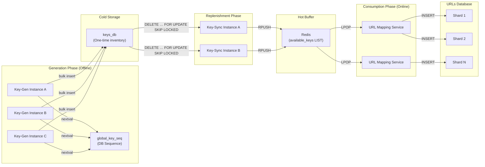

<!-- TOC -->
  * [1. Problem Statement](#1-problem-statement)
  * [2. High-Level Architecture](#2-high-level-architecture)
  * [3. Generation Phase – Key-Gen Service (Factory)](#3-generation-phase--key-gen-service-factory)
  * [Why a Single Key-Gen Is a Problem (SPOF)](#why-a-single-key-gen-is-a-problem-spof)
  * [5. Why Sequential Keys Are the Right Choice](#5-why-sequential-keys-are-the-right-choice)
  * [6. The Core Primitive: `global_key_seq`](#6-the-core-primitive-global_key_seq)
  * [7. Key Insight: Range Leasing (Critical Concept)](#7-key-insight-range-leasing-critical-concept)
  * [8. Range Leasing - How It Works](#8-range-leasing---how-it-works)
    * [Step 1: Lease a Range](#step-1-lease-a-range)
    * [Step 2: Generate Locally](#step-2-generate-locally)
  * [9. Multiple Key-Gen Instances (No SPOF)](#9-multiple-key-gen-instances-no-spof)
  * [10. What If an Instance Finishes Early?](#10-what-if-an-instance-finishes-early)
  * [11. What If an Instance Crashes Mid-Range?](#11-what-if-an-instance-crashes-mid-range)
  * [12. Cold Storage – keys_db](#12-cold-storage--keys_db)
  * [13. Replenishment Phase – Key-Sync Service (Bridge)](#13-replenishment-phase--key-sync-service-bridge)
    * [Critical SQL (Atomic Fetch + Delete)](#critical-sql-atomic-fetch--delete)
  * [14. Hot Buffer – Redis](#14-hot-buffer--redis)
  * [15. Redis SPOF & Mitigation](#15-redis-spof--mitigation)
  * [16. Consumption Phase – URL Mapping Service](#16-consumption-phase--url-mapping-service)
  * [17. URLs Database – Sharding](#17-urls-database--sharding)
    * [Why sharding is required](#why-sharding-is-required)
    * [Shard keys](#shard-keys)
  * [18. Backpressure & Inventory Control (Very Important)](#18-backpressure--inventory-control-very-important)
  * [19. Why Key-Gen Should NOT Check `keys_db`](#19-why-key-gen-should-not-check-keys_db)
  * [20. Why This Design Has NO SPOF](#20-why-this-design-has-no-spof)
  * [22. Final Interview Summary (One-Paragraph Answer)](#22-final-interview-summary-one-paragraph-answer)
<!-- TOC -->


## 1. Problem Statement

A URL shortener needs to generate **unique, short, collision-free IDs at very high throughput** with:

* Low latency for user requests
* No single point of failure (SPOF)
* Horizontal scalability
* Predictable behavior under load
* Ability to handle billions to trillions of URLs

The challenge is **ID generation**, not URL mapping.


## 2. High-Level Architecture

The system is divided into four distinct phases, each with a clear responsibility:

```text
Key-Gen → keys_db (cold) → Key-Sync → Redis (hot) → URL Mapping Service
```

This separation ensures:

* Isolation of concerns
* Failure containment
* High availability



## 3. Generation Phase – Key-Gen Service (Factory)

**Responsibility**

Generate a **large inventory of unique short keys** ahead of time.

**Key Characteristics**

* Runs offline (not on user request path)
* Can tolerate short downtime
* Optimized for throughput, not latency


## Why a Single Key-Gen Is a Problem (SPOF)

If only one Key-Gen instance exists:

* Crash or bug → no new keys
* Redis buffer drains
* URL creation stops
* Even if downtime is “acceptable”, **this is still an SPOF**.

We must make Key-Gen **horizontally scalable**.


## 5. Why Sequential Keys Are the Right Choice

Sequential numeric keys (later Base62-encoded) provide:

* Deterministic uniqueness
* Compact URLs
* Natural ordering
* No randomness collisions
* Easier capacity reasoning


## 6. The Core Primitive: `global_key_seq`

**What it is**

A database sequence (PostgreSQL / MySQL) backed by a `BIGINT`.

```sql
CREATE SEQUENCE global_key_seq
    START WITH 1
    INCREMENT BY 1000000
    NO CYCLE;
```

**What it guarantees**

* Atomic increments
* Global uniqueness
* Thread-safe across machines
* No application-level locks

**Max value**

```text
9,223,372,036,854,775,807  (~9.22 × 10¹⁸)
```

This is not a practical limit (millions of years at internet scale).


## 7. Key Insight: Range Leasing (Critical Concept)

**Do NOT generate one key per DB call.**

Instead:

* Lease **ranges** from the sequence
* Generate keys **locally in memory**


## 8. Range Leasing - How It Works

### Step 1: Lease a Range

Each Key-Gen instance requests one number:

```sql
SELECT nextval('global_key_seq');
```

Assume:

Range size = 1,000,000

If DB returns `1`:

```text
range_start = 1
range_end   = 1,000,000
```

### Step 2: Generate Locally

The instance generates:

```text
1, 2, 3, ..., 1,000,000
```

For each number:

* Convert to Base62
* Bulk insert into `keys_db`

**No further DB coordination required.**


## 9. Multiple Key-Gen Instances (No SPOF)

Example with 3 instances:

| Instance | `nextval()` | Range                 |
|----------|-------------|-----------------------|
| A        | 1           | 1 → 1,000,000         |
| B        | 1,000,001   | 1,000,001 → 2,000,000 |
| C        | 2,000,001   | 2,000,001 → 3,000,000 |

Why this works:

* Sequence is atomic
* Ranges never overlap
* Instances don't know about each other


## 10. What If an Instance Finishes Early?

If Instance A finishes its range first:

* It **does NOT automatically lease another range**
* It checks **inventory backpressure** (explained later)


* If inventory is low → lease next range
* If inventory is sufficient → idle


## 11. What If an Instance Crashes Mid-Range?

Example:

```text
Instance B crashes at key 1,345,221
```

**Result:**

* Keys 1,345,222 → 2,000,000 are lost forever
* No reuse
* No corruption
* No duplicates

**Why this is acceptable:**

* Keyspace is massive (Base62⁷ ≈ 3.5 trillion)
* Density is irrelevant
* Wasting keys avoids coordination and SPOFs

This is a **deliberate design trade-off**.


## 12. Cold Storage – keys_db

**Role**

* Acts as **one-time key inventory**
* Disk-based (cheap, durable)

**Properties**

* Keys are **insert-only**
* Keys are **deleted when consumed**
* Unique constraint exists but rarely triggers


## 13. Replenishment Phase – Key-Sync Service (Bridge)

**Responsibility**

Move keys from slow disk → fast memory.

### Critical SQL (Atomic Fetch + Delete)

```sql
DELETE FROM keys_db
WHERE id IN (
    SELECT id
    FROM keys_db
    LIMIT 1000
    FOR UPDATE SKIP LOCKED
)
RETURNING unique_id;
```

Why `FOR UPDATE SKIP LOCKED`?

* Multiple Key-Sync instances can run safely
* No blocking
* No duplicate fetching
* Natural parallelism


**Why delete immediately?**

* Prevents double spending
* DB becomes a one-time dispenser
* Key is now "in circulation"


## 14. Hot Buffer – Redis

**Role**

* Ultra-low latency key checkout
* Closest to user traffic

**Data Structure**

```text
LIST available_keys
```

**Insert**

```text
RPUSH available_keys key1 key2 key3 ...
```

**Consume**

```text
LPOP available_keys
```

Properties:

* Atomic
* Single-threaded command execution
* Zero collisions
* Sub-millisecond latency


## 15. Redis SPOF & Mitigation

**Risk**

Single Redis instance = major SPOF.

**Mitigation**

* Redis Sentinel
* 1 Primary + 2 Replicas
* Automatic failover

**Data loss**

If primary crashes before replication:

* Some keys are lost
* Acceptable collateral damage


## 16. Consumption Phase – URL Mapping Service

**Flow**

* `LPOP` from Redis
* Insert mapping into `urls_db`

```sql
INSERT INTO urls (short_key, original_url, user_id)
VALUES ('abc1', 'google.com', 101);
```

**Properties**

* Stateless
* Horizontally scalable
* Behind load balancer


## 17. URLs Database – Sharding

### Why sharding is required

* High write throughput
* Massive data size (10+ TB)

### Shard keys

* `short_key` (recommended)
* or `user_id` (business-dependent)


## 18. Backpressure & Inventory Control (Very Important)

**Problem**

Key-Gen should not generate infinitely.

**Solution: Watermarks on Redis Inventory**

```text
LOW_WATERMARK  = 200,000
```

**Key-Gen Control Logic**

```text
loop forever:
    redis_size = LLEN available_keys
    
    if redis_size < LOW:
        lease_range()
        generate_and_insert()
    else:
        sleep    
```

Redis is:

* Fast
* Accurate
* Closest to consumption


## 19. Why Key-Gen Should NOT Check `keys_db`

* Disk-based
* Slow
* Eventually inconsistent
* Not on hot path

Redis inventory is the **true signal**.


## 20. Why This Design Has NO SPOF

| Component       | SPOF? | Reason                     |
|-----------------|-------|----------------------------|
| Key-Gen         | ❌     | Stateless + multi-instance |
| Sequence        | ❌     | DB-managed, atomic         |
| Key-Sync        | ❌     | SKIP LOCKED                |
| Redis           | ❌     | Sentinel failover          |
| Mapping Service | ❌     | Stateless                  |
| URLs DB         | ❌     | Sharded                    |


## 22. Final Interview Summary (One-Paragraph Answer)

We generate short URLs using pre-generated sequential IDs encoded in Base62. Multiple Key-Gen instances 
lease disjoint numeric ranges from a database sequence, eliminating coordination and SPOFs. 
Keys are stored in a cold database, atomically transferred to Redis using SKIP LOCKED, and 
consumed via Redis LPOP with sub-millisecond latency. Backpressure is applied using Redis 
inventory watermarks, ensuring we generate only as needed. The system trades minimal key wastage
for simplicity, correctness, and high availability, and scales horizontally at every layer.
