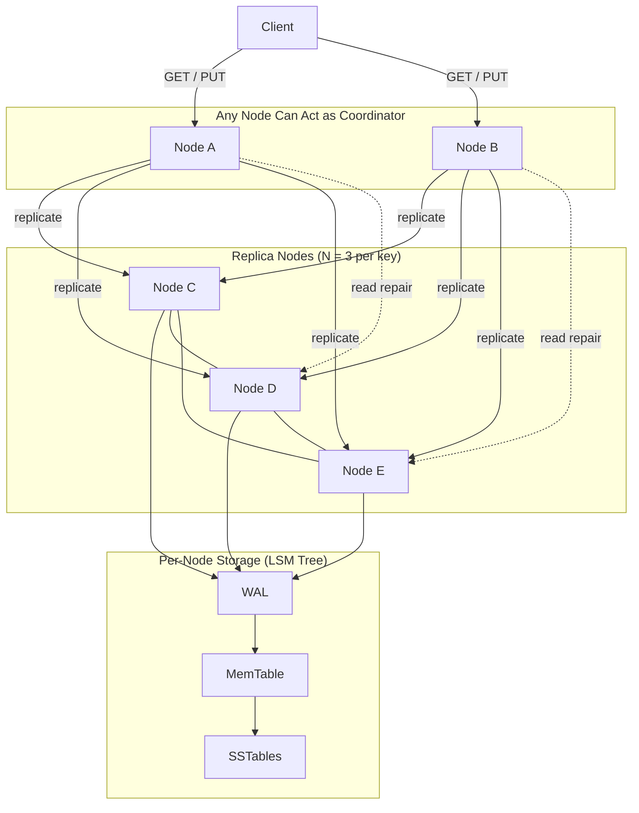

<!-- TOC -->
* [Designing a Dynamo-Style Distributed Key–Value Store](#designing-a-dynamo-style-distributed-keyvalue-store)
  * [Resource](#resource)
  * [Goal Recap (Why this system exists)](#goal-recap-why-this-system-exists)
* [1. Storage Engine: LSM Trees](#1-storage-engine-lsm-trees)
  * [Why we need a storage engine at all](#why-we-need-a-storage-engine-at-all)
  * [Why LSM Trees are chosen](#why-lsm-trees-are-chosen)
    * [Core idea](#core-idea)
  * [Write Path (Step by Step)](#write-path-step-by-step)
    * [Step 1: Write-Ahead Log (WAL)](#step-1-write-ahead-log-wal)
    * [Step 2: MemTable (in memory)](#step-2-memtable-in-memory)
    * [Step 3: Flush to SSTable](#step-3-flush-to-sstable)
    * [Step 4: Compaction](#step-4-compaction)
  * [Trade-offs (Be explicit in interviews)](#trade-offs-be-explicit-in-interviews)
* [2. Partitioning: Consistent Hashing](#2-partitioning-consistent-hashing)
  * [Problem we are solving](#problem-we-are-solving)
  * [How consistent hashing works](#how-consistent-hashing-works)
    * [Hash ring concept](#hash-ring-concept)
    * [Ownership rule (very important)](#ownership-rule-very-important)
  * [Example](#example)
  * [Virtual Nodes (vnodes)](#virtual-nodes-vnodes)
  * [Benefits](#benefits)
* [3. Replication: Leaderless Replication](#3-replication-leaderless-replication)
  * [Problem](#problem)
  * [Replication model](#replication-model)
  * [Quorum parameters](#quorum-parameters)
  * [What this configuration gives you](#what-this-configuration-gives-you)
  * [Trade-offs](#trade-offs)
* [4. Request Coordination: Coordinator Logic](#4-request-coordination-coordinator-logic)
  * [Core idea (critical)](#core-idea-critical)
  * [Write Flow (PUT) – Example](#write-flow-put--example)
    * [Step 1: Client → any node](#step-1-client--any-node)
    * [Step 2: Node B becomes coordinator](#step-2-node-b-becomes-coordinator)
    * [Step 3: Find replicas](#step-3-find-replicas)
    * [Step 4: Coordinator sends writes](#step-4-coordinator-sends-writes)
    * [Step 5: Each replica does local work](#step-5-each-replica-does-local-work)
    * [Step 6: Wait for W ACKs](#step-6-wait-for-w-acks)
  * [Read Flow (GET) – Example](#read-flow-get--example)
    * [Step 1–3: Same coordinator logic](#step-13-same-coordinator-logic)
    * [Step 4: Replicas return local versions](#step-4-replicas-return-local-versions)
    * [Step 5: Coordinator resolves conflicts (LWW)](#step-5-coordinator-resolves-conflicts-lww)
    * [Step 6: Return value to client](#step-6-return-value-to-client)
    * [Step 7: Read repair (optional)](#step-7-read-repair-optional)
  * [Why coordinator logic matters](#why-coordinator-logic-matters)
* [5. Failure Detection: Gossip Protocol](#5-failure-detection-gossip-protocol)
  * [Problem](#problem-1)
  * [Gossip basics](#gossip-basics)
  * [What gossip provides](#what-gossip-provides)
  * [Trade-offs](#trade-offs-1)
* [6. Concurrent Writes: Last-Write-Wins (LWW)](#6-concurrent-writes-last-write-wins-lww)
  * [Problem](#problem-2)
  * [LWW solution](#lww-solution)
  * [Why LWW is chosen](#why-lww-is-chosen)
  * [Trade-offs (must state explicitly)](#trade-offs-must-state-explicitly)
* [7. Consistency Maintenance](#7-consistency-maintenance)
  * [7.1 Read Repair](#71-read-repair)
    * [What it does](#what-it-does)
    * [Example](#example-1)
    * [Benefits](#benefits-1)
  * [7.2 Anti-Entropy (Background Repair)](#72-anti-entropy-background-repair)
    * [Problem](#problem-3)
    * [Solution](#solution)
    * [Benefits](#benefits-2)
  * [Putting It All Together (Interview Closure)](#putting-it-all-together-interview-closure)
  * [Architecture Diagram](#architecture-diagram)
  * [One-Sentence Interview Summary](#one-sentence-interview-summary)
<!-- TOC -->

# Designing a Dynamo-Style Distributed Key–Value Store

## Resource

* Neetcode - Design a Key-Value Store

---

## Goal Recap (Why this system exists)

We want a key–value store that:

* keeps working even if nodes fail
* remains available during partitions
* scales horizontally
* favors **writes and uptime** over strict consistency

This is the same problem Amazon Dynamo was designed to solve:

> *Shopping carts must be writable even if parts of the system are down.*

So the system is **AP-oriented** in CAP terms.

---

# 1. Storage Engine: LSM Trees

## Why we need a storage engine at all

Each node in the cluster is responsible for **persisting data locally**.
That means:

* fast writes
* durability
* acceptable read performance

Random disk writes are slow → so we **avoid them**.

---

## Why LSM Trees are chosen

### Core idea

> Turn many small random writes into **sequential disk writes**.

LSM Trees do this by **buffering writes in memory** and writing them to disk in batches.

---

## Write Path (Step by Step)

Assume a replica receives:

```text
PUT("user123", "Alice")
```

### Step 1: Write-Ahead Log (WAL)

* The write is appended to a log on disk
* This guarantees durability if the node crashes

```text
WAL: PUT user123 = Alice
```

**Why this matters:**
If the node crashes before flushing data to disk, it can replay the WAL.

---

### Step 2: MemTable (in memory)

* The key/value is inserted into a sorted in-memory structure

```text
MemTable:
user123 → Alice
```

**Why sorted?**
Because later we’ll write it to disk in sorted order.

---

### Step 3: Flush to SSTable

When MemTable fills up:

* it is frozen
* written sequentially to disk as an **immutable SSTable**

```text
SSTable:
user123 → Alice
```

---

### Step 4: Compaction

Over time:

* many SSTables exist
* background compaction merges them
* old versions and tombstones are removed

---

## Trade-offs (Be explicit in interviews)

**Pros**

* Extremely fast writes
* Sequential disk IO
* Good for write-heavy workloads

**Cons**

* Reads may check multiple SSTables
* Compaction causes write amplification
* Deletes are logical (tombstones)

---

# 2. Partitioning: Consistent Hashing

## Problem we are solving

We need to answer:

> “Which node should store this key?”

We want:

* no central directory
* minimal reshuffling when nodes join/leave

---

## How consistent hashing works

### Hash ring concept

* Hash space is a circle (0 → 2³²-1)
* Nodes are placed on the ring
* Keys are also hashed onto the ring

---

### Ownership rule (very important)

> A key belongs to the **first node encountered clockwise** from the key’s hash.

---

## Example

Nodes on the ring:

```text
A ---- B ---- C ---- D ---- E
```

Key hash lands between **B and C**.

➡ Owner is **C**

---

## Virtual Nodes (vnodes)

Instead of 1 position per node:

```text
A owns: A1, A2, A3
B owns: B1, B2, B3
```

**Why vnodes matter**

* Smooth load distribution
* Easier rebalancing
* One physical node failure affects only its vnodes

---

## Benefits

* Minimal data movement
* Horizontal scalability
* No metadata service needed

---

# 3. Replication: Leaderless Replication

## Problem

A single copy of data is fragile.

We want:

* fault tolerance
* availability during failures

---

## Replication model

Each key is stored on **N distinct nodes**.

Example:

```text
N = 3
```

Even if the cluster has 100 nodes, **each key is stored on only 3**.

---

## Quorum parameters

| Parameter | Meaning                     |
| --------- | --------------------------- |
| N         | Replicas per key            |
| W         | Writes required for success |
| R         | Reads required              |

Typical:

```text
N = 3, W = 2, R = 2
```

---

## What this configuration gives you

* tolerate 1 replica failure
* high availability
* probabilistic freshness on reads

---

## Trade-offs

* replicas may diverge
* no single “source of truth”
* conflict resolution required

---

# 4. Request Coordination: Coordinator Logic

## Core idea (critical)

> **There is no leader and no router.**
> Any node can coordinate a request.

Coordinator is:

* **temporary**
* **per-request**
* **not special**

---

## Write Flow (PUT) – Example

Client sends:

```text
PUT("user123", "Alice")
```

### Step 1: Client → any node

```text
Client → Node B
```

Client does **not** know where data lives.

---

### Step 2: Node B becomes coordinator

Node B:

* hashes the key
* finds replicas
* manages quorum

---

### Step 3: Find replicas

```text
hash("user123") → replicas = [C, D, E]
```

---

### Step 4: Coordinator sends writes

```text
B → C : PUT(user123, Alice, ts=100)
B → D : PUT(user123, Alice, ts=100)
B → E : PUT(user123, Alice, ts=100)
```

---

### Step 5: Each replica does local work

On each replica:

* append to WAL
* update MemTable
* return ACK

---

### Step 6: Wait for W ACKs

Coordinator waits for:

```text
W = 2 ACKs
```

Then returns success to client.

---

## Read Flow (GET) – Example

Client sends:

```text
GET("user123")
```

---

### Step 1–3: Same coordinator logic

Coordinator hashes key and contacts replicas:

```text
C, D, E
```

---

### Step 4: Replicas return local versions

```text
C → ("Alice", ts=100)
D → ("Alice", ts=90)
E → timeout
```

---

### Step 5: Coordinator resolves conflicts (LWW)

```text
max(ts) = 100 → "Alice"
```

---

### Step 6: Return value to client

---

### Step 7: Read repair (optional)

Coordinator notices D is stale and updates it.

---

## Why coordinator logic matters

* Clients are simple
* Failures handled internally
* No SPOF

---

# 5. Failure Detection: Gossip Protocol

## Problem

Nodes can fail silently.
We need cluster membership **without a leader**.

---

## Gossip basics

Each node periodically:

* picks random peers
* exchanges membership info
* spreads failure suspicion

---

## What gossip provides

* decentralized failure detection
* eventual agreement
* scalable to thousands of nodes

---

## Trade-offs

* failure detection is probabilistic
* views may lag slightly

Acceptable for AP systems.

---

# 6. Concurrent Writes: Last-Write-Wins (LWW)

## Problem

Two clients write concurrently:

```text
PUT(x = 1)
PUT(x = 2)
```

On different coordinators.

---

## LWW solution

Each write has a timestamp.

```text
(x=1, ts=10)
(x=2, ts=12)
```

Replica keeps the value with **largest timestamp**.

---

## Why LWW is chosen

* extremely simple
* minimal metadata
* predictable behavior

---

## Trade-offs (must state explicitly)

* lost updates possible
* clock skew can cause anomalies
* deletes may override newer writes

Dynamo **accepts this**.

---

# 7. Consistency Maintenance

Leaderless replication means replicas **will diverge**.
We need mechanisms to fix that.

---

## 7.1 Read Repair

### What it does

Fixes stale replicas **during reads**.

---

### Example

Coordinator reads:

```text
C: ts=100
D: ts=90
```

Coordinator:

* returns ts=100 to client
* sends repair write to D

---

### Benefits

* low overhead
* improves hot keys quickly

---

## 7.2 Anti-Entropy (Background Repair)

### Problem

Cold keys may never be read.

---

### Solution

* Periodic background sync
* Compare data summaries (Merkle trees)
* Repair mismatches

---

### Benefits

* eventual convergence
* independent of reads

---

## Putting It All Together (Interview Closure)

This system works because:

* **LSM Trees** absorb massive writes efficiently
* **Consistent hashing** partitions data without coordination
* **Leaderless replication** maximizes availability
* **Coordinator logic** hides complexity from clients
* **Gossip** detects failures without SPOFs
* **LWW** resolves conflicts cheaply
* **Read repair + anti-entropy** ensure eventual consistency

## Architecture Diagram



---

## One-Sentence Interview Summary

> This Dynamo-style store prioritizes availability by using leaderless replication, 
> consistent hashing, quorum reads/writes, gossip-based failure detection, and 
> LSM-based storage, accepting eventual consistency and simple conflict resolution in 
> exchange for scalability and fault tolerance.
> 


