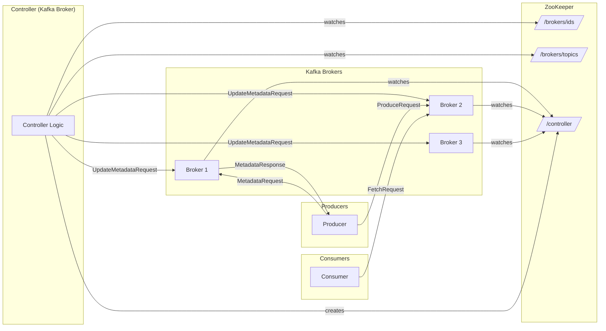

<!-- TOC -->
* [How to Design a Distributed Messaging System like Kafka?](#how-to-design-a-distributed-messaging-system-like-kafka)
  * [Resources](#resources)
  * [High-Level Components](#high-level-components)
  * [Step 0: What we are trying to store (clarify the object)](#step-0-what-we-are-trying-to-store-clarify-the-object)
  * [Step 1: Topic as a logical namespace](#step-1-topic-as-a-logical-namespace)
  * [Step 2: Why a topic cannot be a single file](#step-2-why-a-topic-cannot-be-a-single-file)
  * [Step 3: Partition = unit of storage](#step-3-partition--unit-of-storage)
  * [Step 4: How a partition is stored physically](#step-4-how-a-partition-is-stored-physically)
  * [Step 5: Partition file layout (important but simple)](#step-5-partition-file-layout-important-but-simple)
  * [Step 6: Offset assignment (critical)](#step-6-offset-assignment-critical)
  * [Step 7: Where partitions live (distributed aspect)](#step-7-where-partitions-live-distributed-aspect)
  * [Step 8: Metadata required to make this work](#step-8-metadata-required-to-make-this-work)
  * [One-sentence summary (lock this in)](#one-sentence-summary-lock-this-in)
  * [Step 9: ZooKeeper Fundamentals](#step-9-zookeeper-fundamentals)
    * [What ZooKeeper is (first principles)](#what-zookeeper-is-first-principles)
    * [ZooKeeper Data Model](#zookeeper-data-model)
    * [Persistent vs Ephemeral znodes (critical)](#persistent-vs-ephemeral-znodes-critical)
      * [Persistent znodes](#persistent-znodes)
      * [Ephemeral znodes](#ephemeral-znodes)
    * [Watches (how ZooKeeper notifies changes)](#watches-how-zookeeper-notifies-changes)
    * [ZooKeeper Guarantees (important to say explicitly)](#zookeeper-guarantees-important-to-say-explicitly)
  * [Step 10: Kafka Controller (Decision Maker)](#step-10-kafka-controller-decision-maker)
    * [What is the Controller?](#what-is-the-controller)
    * [What the Controller does](#what-the-controller-does)
    * [ZooKeeper vs Controller (mental model)](#zookeeper-vs-controller-mental-model)
    * [How metadata flows (end-to-end)](#how-metadata-flows-end-to-end)
  * [Step 11: Kafka Coordination & Metadata Flow – A Complete Explanation (Corrected)](#step-11-kafka-coordination--metadata-flow--a-complete-explanation-corrected)
    * [Mental Model (Anchor This First)](#mental-model-anchor-this-first)
    * [Case 1 - Broker Startup & Controller Election (`/controller`)](#case-1---broker-startup--controller-election-controller)
      * [Step 1.1: Broker starts and connects to ZooKeeper](#step-11-broker-starts-and-connects-to-zookeeper)
      * [Step 1.2: Broker registers itself (liveness)](#step-12-broker-registers-itself-liveness)
      * [Step 1.3: Controller election (`/controller`)](#step-13-controller-election-controller)
      * [Step 1.4: Watches (corrected and precise)](#step-14-watches-corrected-and-precise)
    * [Case 2 - How Metadata Is Built Inside Brokers](#case-2---how-metadata-is-built-inside-brokers)
    * [Case 3 - Creating a New Topic (Clarified)](#case-3---creating-a-new-topic-clarified)
      * [Step 3.1: Admin sends CreateTopic request](#step-31-admin-sends-createtopic-request)
      * [Step 3.2: Broker forwards request to controller](#step-32-broker-forwards-request-to-controller)
      * [Step 3.3: Controller computes partition placement](#step-33-controller-computes-partition-placement)
      * [Step 3.4: Controller persists metadata to ZooKeeper](#step-34-controller-persists-metadata-to-zookeeper)
      * [Step 3.5: Controller notifies brokers (important correction)](#step-35-controller-notifies-brokers-important-correction)
    * [Case 4 - Broker Goes Down](#case-4---broker-goes-down)
      * [Step 4.1: Broker crashes](#step-41-broker-crashes)
      * [Step 4.2: ZooKeeper detects failure](#step-42-zookeeper-detects-failure)
      * [Step 4.3: Controller reacts](#step-43-controller-reacts)
      * [Step 4.4: Leader re-election](#step-44-leader-re-election)
      * [Step 4.5: Metadata update and propagation](#step-45-metadata-update-and-propagation)
      * [Step 4.6: Client recovery](#step-46-client-recovery)
    * [Case 5 - How Producers Know Where to Send Data](#case-5---how-producers-know-where-to-send-data)
      * [Step 5.1: Bootstrap phase](#step-51-bootstrap-phase)
      * [Step 5.2: Metadata request](#step-52-metadata-request)
      * [Step 5.3: Broker responds from local cache](#step-53-broker-responds-from-local-cache)
      * [Step 5.4: Partition selection](#step-54-partition-selection)
      * [Step 5.5: Direct write to leader](#step-55-direct-write-to-leader)
    * [Case 6 - Why Producers Never Talk to the Controller](#case-6---why-producers-never-talk-to-the-controller)
    * [7. Final Durable Mental Model (Corrected)](#7-final-durable-mental-model-corrected)
    * [Final interview-grade one-liner](#final-interview-grade-one-liner)
  * [Step 12: How producers decide which partition to write to](#step-12-how-producers-decide-which-partition-to-write-to)
    * [First principle (very important)](#first-principle-very-important)
    * [There are only three valid strategies](#there-are-only-three-valid-strategies)
      * [1. Key-based partitioning (most important)](#1-key-based-partitioning-most-important)
      * [2. Round-robin partitioning (no key)](#2-round-robin-partitioning-no-key)
      * [3. Explicit partition (advanced / rare)](#3-explicit-partition-advanced--rare)
    * [Important correction (this matters)](#important-correction-this-matters)
    * [Why partition choice MUST be deterministic](#why-partition-choice-must-be-deterministic)
    * [What happens if partitions increase later?](#what-happens-if-partitions-increase-later)
    * [One-sentence summary (memorize)](#one-sentence-summary-memorize)
  * [Step 13: How partitions are assigned to brokers (and leaders are chosen)](#step-13-how-partitions-are-assigned-to-brokers-and-leaders-are-chosen)
    * [Step 13.1: Brokers (what they are)](#step-131-brokers-what-they-are)
    * [Step 13.2: Partition → broker mapping](#step-132-partition--broker-mapping)
    * [Step 13.3: Why a leader is required](#step-133-why-a-leader-is-required)
    * [Step 13.4: What followers are (preview)](#step-134-what-followers-are-preview)
    * [Step 13.5: How partition placement is decided](#step-135-how-partition-placement-is-decided)
    * [Step 13.6: How producers use this information](#step-136-how-producers-use-this-information)
    * [Step 13.7: What happens if a leader fails (high-level)](#step-137-what-happens-if-a-leader-fails-high-level)
    * [One-sentence summary (memorize)](#one-sentence-summary-memorize-1)
  * [Step 14: Replication — how partitions survive failures](#step-14-replication--how-partitions-survive-failures)
    * [Step 14.1: Replication factor (RF)](#step-141-replication-factor-rf)
    * [Step 14.2: Leader and followers](#step-142-leader-and-followers)
    * [Step 14.3: How replication works (mechanically)](#step-143-how-replication-works-mechanically)
      * [Followers replicate](#followers-replicate)
    * [Step 14.4: In-Sync Replicas (ISR)](#step-144-in-sync-replicas-isr)
    * [Step 14.5: Why ISR exists](#step-145-why-isr-exists)
    * [Step 14.6: Acknowledging writes (high-level)](#step-146-acknowledging-writes-high-level)
    * [Step 14.7: Leader failure and recovery](#step-147-leader-failure-and-recovery)
    * [Step 14.8: Why leader must be chosen from ISR](#step-148-why-leader-must-be-chosen-from-isr)
    * [Step 14.9: What replication guarantees](#step-149-what-replication-guarantees)
    * [One-sentence summary (memorize)](#one-sentence-summary-memorize-2)
  * [Step 15: High-Water Mark (HWM) — why consumers don't see unsafe data](#step-15-high-water-mark-hwm--why-consumers-dont-see-unsafe-data)
    * [Step 15.1: The problem illustrated](#step-151-the-problem-illustrated)
    * [Step 15.2: What can go wrong without protection](#step-152-what-can-go-wrong-without-protection)
    * [Step 15.3: Kafka’s solution — High-Water Mark](#step-153-kafkas-solution--high-water-mark)
    * [Step 15.4: Visibility rule (this is the key)](#step-154-visibility-rule-this-is-the-key)
    * [Step 15.5: How HWM moves forward](#step-155-how-hwm-moves-forward)
    * [Step 15.6: Why this guarantees safety](#step-156-why-this-guarantees-safety)
    * [Step 15.7: Important clarification (very common confusion)](#step-157-important-clarification-very-common-confusion)
    * [Step 15.8: Producer acknowledgments vs HWM (brief preview)](#step-158-producer-acknowledgments-vs-hwm-brief-preview)
    * [One-sentence summary (memorize)](#one-sentence-summary-memorize-3)
  * [Step 16: Producer acknowledgments (acks) — write safety vs performance](#step-16-producer-acknowledgments-acks--write-safety-vs-performance)
    * [First principle (anchor this)](#first-principle-anchor-this)
    * [There are only 3 valid acks settings](#there-are-only-3-valid-acks-settings)
    * [1. acks = 0 (fire-and-forget)](#1-acks--0-fire-and-forget)
    * [2. acks = 1 (leader-only acknowledgment)](#2-acks--1-leader-only-acknowledgment)
    * [3. acks = all (ISR acknowledgment)](#3-acks--all-isr-acknowledgment)
    * [How acks and HWM work together (THIS is key)](#how-acks-and-hwm-work-together-this-is-key)
    * [Why Kafka separates these concerns](#why-kafka-separates-these-concerns)
    * [Real-world defaults (important)](#real-world-defaults-important)
    * [Common interview pitfall (avoid this)](#common-interview-pitfall-avoid-this)
    * [One-sentence summary (memorize)](#one-sentence-summary-memorize-4)
  * [Step 17: Consumer Groups, Partition Assignment, and Rebalancing](#step-17-consumer-groups-partition-assignment-and-rebalancing)
    * [Step 17.1: Why consumers need coordination](#step-171-why-consumers-need-coordination)
    * [Step 17.2: Consumer group (what it really is)](#step-172-consumer-group-what-it-really-is)
    * [Step 17.3: Partition assignment rule (core rule)](#step-173-partition-assignment-rule-core-rule)
    * [Step 17.4: Why partitions ≥ consumers matters](#step-174-why-partitions--consumers-matters)
    * [Step 17.5: Offset tracking - __consumer_offsets](#step-175-offset-tracking---__consumer_offsets)
      * [1. The Problem: Why does this topic exist?](#1-the-problem-why-does-this-topic-exist)
      * [2. The Structure: What is inside the topic?](#2-the-structure-what-is-inside-the-topic)
        * [The Schema (Key-Value Pair)](#the-schema-key-value-pair)
      * [3. The Location: Where does the data go?](#3-the-location-where-does-the-data-go)
        * [How is the partition chosen?](#how-is-the-partition-chosen)
        * [The "Co-location" Rule](#the-co-location-rule)
      * [4. The Coordinator: The Broker in Charge](#4-the-coordinator-the-broker-in-charge)
      * [5. The Maintenance: Log Compaction](#5-the-maintenance-log-compaction)
      * [6. The Data Flow Summary](#6-the-data-flow-summary)
      * [Final Interview One-Liner](#final-interview-one-liner)
    * [Step 17.6: The Group Membership Protocol & Rebalancing?](#step-176-the-group-membership-protocol--rebalancing)
      * [The Setup](#the-setup)
      * [Phase 1: Discovery (Finding the Boss)](#phase-1-discovery-finding-the-boss)
      * [Phase 2: The Join (Membership Registration)](#phase-2-the-join-membership-registration)
      * [Phase 3: Assignment (The "Sync" Phase)](#phase-3-assignment-the-sync-phase)
      * [Phase 4: The Steady State (Heartbeating)](#phase-4-the-steady-state-heartbeating)
      * [Summary of Who Does What](#summary-of-who-does-what)
      * [One-sentence summary (memorize)](#one-sentence-summary-memorize-5)
  * [What's the format of Log Files](#whats-the-format-of-log-files)
    * [1. What is the actual format of partition log files?](#1-what-is-the-actual-format-of-partition-log-files)
    * [2. Where is the offset stored after a leader writes a message?](#2-where-is-the-offset-stored-after-a-leader-writes-a-message)
<!-- TOC -->

# How to Design a Distributed Messaging System like Kafka?

## Resources

* [System Design - Distributed Messaging Queue | Design Messaging Queue like Kafka, RabbitMQ](https://www.youtube.com/watch?v=oVZtzZVe9Dg)
* [Kafka: How to Design a Distributed Messaging System?](https://www.designgurus.io/course-play/grokking-the-advanced-system-design-interview/doc/messaging-systems-introduction)


## High-Level Components

1. Topic vs Partition
2. Write Path (Producer → Leader)
3. Storage Format
4. Replication & ISR
5. Safety: High-Water Mark & ACKs
6. Metadata, ZooKeeper & Controller

## Step 0: What we are trying to store (clarify the object)

A messaging system stores **messages**, but not randomly.

Each message has:

* topic
* order
* durability requirement

So the **primary abstraction** is:
> An ordered, durable stream of messages
>

## Step 1: Topic as a logical namespace

What is a Topic?

A topic is NOT storage.

A topic is just:

* a name
* a logical grouping of messages

Example:

```text
orders
payments
logs
```

At this stage:

* topic has no location
* topic has no file
* topic has no machine

Think of it as a **directory name**, not a file.


## Step 2: Why a topic cannot be a single file

Suppose we store topic `orders` in one file:

```text
orders.log
```

Problems:

* single machine bottleneck
* limited throughput
* single disk
* no parallel writes
* no parallel reads

So we must split the topic.


## Step 3: Partition = unit of storage

What is a Partition?

> A partition is the actual storage unit.

Each partition is:

* append-only
* ordered
* stored independently

So a topic becomes:

```text
Topic: orders
  ├── Partition 0
  ├── Partition 1
  └── Partition 2
```

Now:

* partitions can live on different machines
* writes scale
* reads scale


## Step 4: How a partition is stored physically

Now we get concrete.

Each **partition is stored as a log**.

That means:
* new messages are appended
* nothing is modified in the middle

Example partition log:

```text
P0.log
[ offset 0 ][ offset 1 ][ offset 2 ][ offset 3 ] ...
```

This is the core design decision.

Why?

* sequential disk writes
* OS page cache friendly
* crash-safe


## Step 5: Partition file layout (important but simple)

A partition is not one giant file forever.

Instead:

```text
Partition P0
  ├── segment-000000.log
  ├── segment-000128.log
  ├── segment-000256.log
```

Each segment:

* fixed size (e.g., 1GB)
* append-only
* immutable once closed

Why segments?

* easier deletion (retention)
* faster recovery
* bounded file size


## Step 6: Offset assignment (critical)

Offsets are:

* per partition
* monotonically increasing

When a message is appended:

```text
next_offset = last_offset + 1
```

Offsets are:

* logical positions
* not array indices
* never reused

This is what enables:

* replay
* consumer independence
* crash recovery


## Step 7: Where partitions live (distributed aspect)

Each partition:

* is assigned to one broker initially
* later replicated (we’ll get to that)

Example:

```text
Broker 1 → orders-P0
Broker 2 → orders-P1
Broker 3 → orders-P2
```

This is how:

* load is distributed
* throughput scales


## Step 8: Metadata required to make this work

To store topics and partitions, the system must track:

* topic name
* number of partitions
* partition → broker mapping
* partition → segment files
* current end offset

This metadata must be:

* durable
* shared across brokers

Now we pause Kafka and explain how this metadata is safely managed.

This is where ZooKeeper enters.


## One-sentence summary (lock this in)

> Topics are logical names; partitions are the actual append-only logs stored on disk, split into segments and 
> distributed across brokers for scale.
>

## Step 9: ZooKeeper Fundamentals

### What ZooKeeper is (first principles)

ZooKeeper is **not** a database and **not** part of the data path.

ZooKeeper is:

> A strongly consistent, replicated coordination service used to store **cluster metadata** and detect failures.

Think of ZooKeeper as:

> A distributed filesystem + notification mechanism

Kafka uses ZooKeeper to answer:

* Who is alive?
* Who is leader?
* What is the cluster state?

---

### ZooKeeper Data Model

ZooKeeper stores data as a **tree of znodes**:

```text
/
├── brokers
│   └── ids
│       ├── 1
│       ├── 2
│       └── 3
├── topics
│   └── orders
│       └── partitions
│           └── 0
│               └── state
└── controller
```

Each znode:

* has a small value (JSON / bytes)
* has version metadata
* can be watched for changes

---

### Persistent vs Ephemeral znodes (critical)

#### Persistent znodes

* Live until explicitly deleted
* Used for **metadata**

Example:

```text
/topics/orders
```

---

#### Ephemeral znodes

* Exist **only while the client session is alive**
* Automatically deleted on crash

Example:

```text
/brokers/ids/1
```

This is how **broker failure detection works**.

ZooKeeper does not ping brokers.

It simply observes session disappearance.

---

### Watches (how ZooKeeper notifies changes)

ZooKeeper supports **watches**:

> “Notify me when this znode or its children change.”

Kafka controller sets watches on:

```text
/brokers/ids
```

If a broker dies:

* its ephemeral node disappears
* ZooKeeper emits an event
* ZooKeeper does nothing else

ZooKeeper **never makes decisions**.

---

### ZooKeeper Guarantees (important to say explicitly)

* ✔ Strong consistency
* ✔ Ordered updates
* ✔ Linearizable writes
* ✔ Automatic failure detection


* ❌ Not high throughput
* ❌ Not a message store
* ❌ Not a decision engine

Kafka deliberately keeps ZooKeeper usage minimal.

---

## Step 10: Kafka Controller (Decision Maker)

### What is the Controller?

The controller is:

> Exactly **one Kafka broker** elected to manage cluster-wide decisions.

Other brokers are:

* normal data brokers
* standby controllers

---

### What the Controller does

The controller:

* assigns partitions to brokers
* elects partition leaders
* manages ISR changes
* reacts to broker failures
* updates metadata in ZooKeeper

The controller:
* ❌ does NOT handle reads
* ❌ does NOT handle writes
* ❌ does NOT serve clients

---

### ZooKeeper vs Controller (mental model)

| ZooKeeper       | Controller         |
|-----------------|--------------------|
| Stores state    | Decides actions    |
| Detects failure | Handles failure    |
| Passive         | Active             |
| Reliable        | Singular authority |

This separation avoids split-brain and scales well.

---

### How metadata flows (end-to-end)

```text
ZooKeeper → Controller → Brokers → Producers / Consumers
```

Clients:

* NEVER talk to ZooKeeper
* ONLY talk to brokers


## Step 11: Kafka Coordination & Metadata Flow – A Complete Explanation (Corrected)

We will answer these core questions:

1. How brokers start, how the controller is selected, and how brokers know where the controller is
2. How metadata is built and propagated
3. What happens when a new topic is created
4. What happens when a broker goes down
5. How producers know where to send data
6. Why producers never talk to the controller
7. Whether brokers store all topic metadata

---

### Mental Model (Anchor This First)

Kafka is split into **planes**:

```text
ZooKeeper  → stores facts (metadata, liveness)
Controller → makes decisions
Brokers    → store data + execute decisions
Producers  → route data using metadata
Consumers  → read data using metadata
```

**Key invariant (lock this in):**

> ZooKeeper is watched only by the controller.
> Ordinary brokers never watch topic metadata directly.




---

### Case 1 - Broker Startup & Controller Election (`/controller`)

#### Step 1.1: Broker starts and connects to ZooKeeper

When a Kafka broker starts:

* It opens a ZooKeeper session
* ZooKeeper assigns a session ID
* No Kafka metadata is loaded yet

ZooKeeper tree (conceptually):

```text
/
```

---

#### Step 1.2: Broker registers itself (liveness)

Each broker creates an **ephemeral znode**:

```text
/brokers/ids/<broker_id>
```

Example:

```text
/brokers/ids/1
```

Value:

```json
{
  "host": "10.0.1.12",
  "port": 9092
}
```

Meaning:

* “Broker 1 is alive”
* If Broker 1 crashes → ZooKeeper deletes this node automatically

This is **how broker failure is detected**.

ZooKeeper does not ping brokers.
It only observes session disappearance.

---

#### Step 1.3: Controller election (`/controller`)

Every broker attempts to create:

```text
/controller
```

Properties:

* Ephemeral
* Exactly one broker can create it

The broker that succeeds becomes the **controller**.

Example value:

```json
{
  "broker_id": 1,
  "timestamp": 1700000000
}
```

**Exactly one controller exists at any time.**

All other brokers are ordinary brokers.

---

#### Step 1.4: Watches (corrected and precise)

* **Controller watches**:

  * `/brokers/ids` → broker join/leave
  * `/brokers/topics` → topic/partition metadata changes

* **Ordinary brokers watch**:

  * `/controller` → to detect controller failure

Important clarification:

> Ordinary brokers do **NOT** watch `/brokers/topics`.
> This avoids the thundering-herd problem.

ZooKeeper only **notifies**.
It never performs decisions or fan-out.

---

### Case 2 - How Metadata Is Built Inside Brokers

1. Broker starts and registers itself:
    ```text
    /brokers/ids/<broker_id>   (ephemeral)
    ```
2. Broker **waits** with an empty metadata cache.
3. **Controller**, which is watching /brokers/ids, detects the new broker.
4. Controller sends a **full cluster snapshot** to the broker via:

    ```text
    UpdateMetadataRequest
    ```

This RPC contains:

* all brokers
* all topics
* all partitions
* leaders
* replicas
* ISR
* leader epochs
* Broker populates its in-memory metadata cache from this RPC.
* Only now does the broker:
    * know which partitions it owns
    * open corresponding log directories
    * start serving requests

➡️ The controller is the sole metadata source.

---

### Case 3 - Creating a New Topic (Clarified)

#### Step 3.1: Admin sends CreateTopic request

Request goes to **any broker**.

---

#### Step 3.2: Broker forwards request to controller

Only the controller is allowed to modify cluster metadata.

---

#### Step 3.3: Controller computes partition placement

In memory, controller decides:

```text
orders-P0 → [B1 (leader), B2]
orders-P1 → [B2 (leader), B3]
orders-P2 → [B3 (leader), B1]
```

This decision is centralized to avoid inconsistency.

---

#### Step 3.4: Controller persists metadata to ZooKeeper

Controller writes metadata:

```text
/brokers/topics/orders/partitions/0/state
```

Value:

```json
{
  "leader": 1,
  "replicas": [1,2],
  "isr": [1,2],
  "leader_epoch": 1
}
```

ZooKeeper now stores the **authoritative state**.

---

#### Step 3.5: Controller notifies brokers (important correction)

ZooKeeper does **NOT** notify all brokers.

Instead:

1. ZooKeeper notifies **controller only**
2. Controller sends `UpdateMetadataRequest` RPCs to all brokers
3. Brokers:
    * create log directories
    * initialize empty logs
    * update metadata cache

Topic is now live.

---

### Case 4 - Broker Goes Down

#### Step 4.1: Broker crashes

Example: Broker 1 crashes.

---

#### Step 4.2: ZooKeeper detects failure

Because `/brokers/ids/1` is ephemeral:

* ZooKeeper deletes it
* ZooKeeper notifies **controller**

ZooKeeper takes no further action.

---

#### Step 4.3: Controller reacts

Controller:

* already has full metadata in memory
* finds partitions where leader == Broker 1

---

#### Step 4.4: Leader re-election

For each affected partition:

1. Remove dead broker from ISR
2. Choose new leader from remaining ISR
3. Increment leader epoch

---

#### Step 4.5: Metadata update and propagation

Controller:

* writes updated state to ZooKeeper
* sends `LeaderAndISRRequest` to brokers

Brokers update their in-memory metadata.

---

#### Step 4.6: Client recovery

* Producers receive NOT_LEADER errors → refresh metadata → retry
* Consumers remain safe due to HWM

---

### Case 5 - How Producers Know Where to Send Data

#### Step 5.1: Bootstrap phase

Producer configuration:

```text
bootstrap.servers = B1,B2,B3
```

These are **ordinary brokers**, not “the controller”.

---

#### Step 5.2: Metadata request

Producer connects to any broker and sends:

```text
MetadataRequest(topic=orders)
```

---

#### Step 5.3: Broker responds from local cache

Broker replies using **its in-memory metadata cache**.

Producer learns:

* partitions
* leaders
* broker addresses

No ZooKeeper involved.

---

#### Step 5.4: Partition selection

Producer computes:

```text
partition = hash(key) % partitions
```

---

#### Step 5.5: Direct write to leader

Producer sends `ProduceRequest` **directly to the partition leader**.

No controller.
No ZooKeeper.
No indirection.

---

### Case 6 - Why Producers Never Talk to the Controller

This is a deliberate design choice.

If producers talked to the controller:

* controller becomes a bottleneck
* leader elections slow down
* cluster stability degrades

Therefore:

> **Controller is control-plane only and invisible to clients.**

Even if a producer connects to the controller broker:

* it is treated as a normal broker
* no special APIs exist

---

### 7. Final Durable Mental Model (Corrected)

```text
Broker startup:
  → register in ZooKeeper
  → controller elected via /controller

Metadata:
  → stored in ZooKeeper
  → controller watches ZooKeeper
  → controller pushes metadata to brokers

Controller:
  → single decision-maker
  → reacts to ZooKeeper events
  → propagates metadata via RPC

Brokers:
  → store full metadata in memory
  → serve metadata to clients
  → never watch topic znodes

Producers:
  → bootstrap to any broker
  → fetch metadata from brokers
  → write directly to leaders

ZooKeeper:
  → stores facts
  → detects liveness
  → never fan-outs to brokers
```

---

### Final interview-grade one-liner

> In ZooKeeper-based Kafka, only the controller watches ZooKeeper for metadata changes; 
> it makes all coordination decisions and pushes updated metadata to brokers via RPC, while 
> brokers serve metadata to clients and producers write directly to partition leaders.


## Step 12: How producers decide which partition to write to

At this point we have:

* Topic = logical name
* Partitions = actual logs
* Each partition lives on some broker

Now the key question:
> When a producer sends a message to a topic, how does the system choose the partition?

This decision is crucial, because it determines:

* ordering
* load balancing
* scalability

### First principle (very important)
> Partition choice happens BEFORE the message is written.
>

Once written:

* the message belongs permanently to that partition
* its order is fixed relative to other messages in that partition

### There are only three valid strategies

Kafka (and any sane messaging system) allows **exactly these patterns**.

#### 1. Key-based partitioning (most important)

**Idea**

If a message has a **key**, we use it.

Rule:

```text
partition = hash(key) % number_of_partitions
```

**Example:**

```text
Topic: orders
Partitions: 3  (P0, P1, P2)

Message:
  key = order_id = 123
```

```text
hash(123) % 3 = 1
```

→ Message goes to **Partition 1**

**Why this exists**

This guarantees:
> All messages with the same key go to the same partition.
>

Which means:

* ordering per key is preserved
* stateful processing becomes possible

Example:

* all updates for order `123`
* all events for user `456`


**Trade-off**

* If one key is “hot”, one partition becomes hot
* Load may be uneven

But correctness > perfect balance.


#### 2. Round-robin partitioning (no key)

Idea

If the producer does not care about ordering per key:

* distribute messages evenly
* maximize throughput

**Example**

Messages arrive:

```text
M1 → P0
M2 → P1
M3 → P2
M4 → P0
```

**Why this exists**

* best load balancing
* avoids hot partitions
* great for logs, metrics, events

**Trade-off**

* No ordering guarantees across messages
* Related messages may go to different partitions

#### 3. Explicit partition (advanced / rare)

Producer explicitly says:

```text
send(topic="orders", partition=2)
```


Used when:

* producer knows exactly what it’s doing
* very controlled pipelines

Dangerous if misused.

### Important correction (this matters)

> The broker does NOT randomly choose partitions.

Partitioning is decided by:

* producer-side logic (partitioner)
* using cluster metadata

This avoids:

* broker bottlenecks
* extra hops

### Why partition choice MUST be deterministic

Imagine two producers sending related messages.

If partitioning were random:

* ordering breaks
* state consistency breaks

So the rule is:

> Given the same key and metadata, all producers must compute the same partition.

### What happens if partitions increase later?

This is a subtle but important point.

If you go from:

```text
3 partitions → 6 partitions
```

Then:

```text
hash(key) % partitions
```

changes.

Result:

* same key may map to a different partition
* ordering per key breaks across time

This is why:

* partition count is usually fixed early
* increasing partitions is done carefully

### One-sentence summary (memorize)

> Producers choose partitions deterministically—usually by hashing the message key—to preserve
> ordering while enabling parallelism.
> 


## Step 13: How partitions are assigned to brokers (and leaders are chosen)

At this point we have:

* Topics
* Partitions
* Producers choosing partitions

Now the question is:

> Where does a partition actually live, and who accepts writes for it?

### Step 13.1: Brokers (what they are)

A broker is just a server in the messaging cluster.

Each broker:

* has disk
* stores partition logs
* serves read/write requests

Example cluster:

```text
Broker 1
Broker 2
Broker 3
```

### Step 13.2: Partition → broker mapping

Each **partition is assigned to exactly one broker as its leader**.

Example:

```text
Topic: orders

Partition 0 → Broker 1
Partition 1 → Broker 2
Partition 2 → Broker 3
```

This mapping is **cluster metadata**.

Important:

* partitions are the unit of placement
* brokers do NOT store entire topics
* each broker stores some partitions from many topics

This mapping is authored by the controller and propagated to brokers via
`UpdateMetadataRequest`.

### Step 13.3: Why a leader is required

For **each partition**, one broker is chosen as the **leader**.

Rule:

> All writes go to the partition leader.

Why?

* single writer → total ordering
* simple offset assignment
* avoids conflicts

Without a leader:

* two brokers could assign offsets concurrently
* ordering would break


### Step 13.4: What followers are (preview)

Other brokers may store replicas of the same partition:

```text
Partition 0:
  Leader   → Broker 1
  Follower → Broker 2
  Follower → Broker 3  
```

But:

* only the leader accepts writes
* followers replicate from leader

(Followers are not in the write path for producers.)

### Step 13.5: How partition placement is decided

When a topic is created, the controller decides:

* number of partitions
* replication factor
* which brokers host replicas
* which broker is leader initially

Goal:

* spread load evenly
* avoid hot brokers
* maximize fault tolerance

Example strategy:

* round-robin placement
* rack-awareness (advanced)

The resulting assignment is written to ZooKeeper and pushed to brokers via
`UpdateMetadataRequest`.

### Step 13.6: How producers use this information

Producers:

1. Connect to a bootstrap broker
2. Send a MetadataRequest
3. Learn:
    * partition count
    * partition → leader broker mapping
4. Send writes **directly to the leader broker**

This avoids:

* central routers
* controller involvement
* extra network hops


### Step 13.7: What happens if a leader fails (high-level)

If a leader broker crashes:

* ZooKeeper detects broker death
* Controller elects a new leader from ISR
* Controller updates metadata
* Controller sends UpdateMetadataRequest to brokers
* Producers receive NOT_LEADER errors
* Producers refresh metadata via MetadataRequest and retry

No manual intervention required.

(Leader election details are covered next.)


### One-sentence summary (memorize)

> Partitions are distributed across brokers, and each partition has a single leader broker that handles 
> all writes to preserve ordering.
> 

## Step 14: Replication — how partitions survive failures

At this point we have:

* Topics
* Partitions
* Brokers
* One leader per partition

Now the problem:
> What happens if the leader broker crashes?

Without replication:

* data loss
* system downtime

So replication is not optional.


### Step 14.1: Replication factor (RF)

When creating a topic, we choose:

```text
replication.factor = N
```

Example:

```text
RF = 3
```

Meaning:

* each partition exists on 3 brokers
* 1 leader
* 2 followers


### Step 14.2: Leader and followers

For a single partition:

```text
Partition P0:
Leader   → Broker 1
Follower → Broker 2
Follower → Broker 3
```

Rules:

* Leader handles **all writes**
* Followers **replicate from leader**
* Followers never accept writes from producers

This is crucial for **ordering and correctness**.


### Step 14.3: How replication works (mechanically)

**Write arrives**

1. Producer sends message to **leader**
2. Leader:
    * appends message to its local log
    * assigns next offset

Example:

```text
Leader log: [0][1][2][3]
```

#### Followers replicate

Followers:

* pull data from leader
* append the same bytes in the same order

```text
Follower logs:
[0][1][2][3]
```

Important:

* followers do NOT reassign offsets
* offsets are defined solely by the leader


### Step 14.4: In-Sync Replicas (ISR)

Not all replicas are always healthy.

Kafka defines:

> ISR = replicas that are fully caught up with the leader

Example:

```text
Leader (B1):    [0][1][2][3][4]
Follower (B2):  [0][1][2][3][4]  ← in sync
Follower (B3):  [0][1][2]        ← lagging
```

ISR = `{B1, B2}`

Lagging replicas are:

* temporarily excluded
* not trusted for safety decisions


### Step 14.5: Why ISR exists

If a follower is:

* slow
* partitioned
* overloaded

You **cannot** wait for it forever.

So the system says:

> Only ISR replicas are trusted for durability and leader election.
> 

This allows:

* progress
* availability


### Step 14.6: Acknowledging writes (high-level)

A write is considered **successful** when:

* leader has written it
* required number of ISR replicas have it

This depends on configuration (`acks`).

(Explained in the next section.)


### Step 14.7: Leader failure and recovery

Now the important part.

**Leader crashes**

```text
Leader B1 dies
```

System reaction:

* ZooKeeper detects broker failure
* Controller selects new leader from ISR
* Controller updates metadata in ZooKeeper
* Controller sends `UpdateMetadataRequest` to all brokers
* Brokers update in-memory metadata
* Producers refresh metadata and retry

Result:

* no data loss (because ISR had the data)
* minimal downtime


### Step 14.8: Why leader must be chosen from ISR

If you choose a non-ISR replica:

* it may miss messages
* consumers may see gaps
* data loss possible

This is why:
> Only ISR replicas are eligible leaders
> 


### Step 14.9: What replication guarantees

With proper configuration:

* ✔ Data survives broker failures
* ✔ Ordering is preserved
* ✔ Writes are durable
* ✔ System remains available

Trade-off:

* additional latency
* replication overhead

### One-sentence summary (memorize)

> Kafka replicates each partition across brokers with a single leader handling writes 
> and followers replicating, while ISR ensures safe leader election and durability under failures.
> 


## Step 15: High-Water Mark (HWM) — why consumers don't see unsafe data

At this point we have:

* Leader
* Followers
* ISR (in-sync replicas)
* Replication in progress

Now the **core problem**:

> A leader may accept a write that followers have not yet replicated.
If the leader crashes now, should consumers have seen that message?

If yes → **data loss on leader failover**
If no → **safer reads**

Kafka chooses safety


### Step 15.1: The problem illustrated

Assume:

```text
Partition P0
ISR = {B1 (Leader), B2 (Follower)}
```

Current logs:

```text
B1 (Leader):   [0][1][2][3][4]
B2 (Follower): [0][1][2][3]
```

Message `4`:

* exists only on the leader
* not yet replicated to all ISR members


### Step 15.2: What can go wrong without protection

If Kafka allowed consumers to read offset `4`:

1. Consumer reads message `4`
2. Leader crashes
3. Follower B2 becomes leader
4. B2 does not have message 4

Now:

* consumer has read data that no longer exists
* non-repeatable read
* correctness broken

This is **not acceptable** in a durable messaging system.


### Step 15.3: Kafka’s solution — High-Water Mark

Kafka introduces:

> High-Water Mark (HWM)
= highest offset that all ISR replicas have safely stored

In our example:

```text
Leader:   [0][1][2][3][4]
Follower: [0][1][2][3]

HWM = 3
```


### Step 15.4: Visibility rule (this is the key)

> Consumers can only read messages with offset ≤ HWM

So:

* offset 3 → visible
* offset 4 → hidden

Even though:

* leader has it
* producer may have been acknowledged (depending on acks)


### Step 15.5: How HWM moves forward

When follower catches up:

```text
Follower: [0][1][2][3][4]
```

Now all ISR replicas have offset `4`.

So:

```text
HWM = 4
```

Kafka:

* advances HWM
* exposes message 4 to consumers


### Step 15.6: Why this guarantees safety

Because:

* any message visible to consumers
* is guaranteed to exist on **all ISR replicas**

So if leader crashes:

* new leader already has all visible messages
* no data disappears


### Step 15.7: Important clarification (very common confusion)

HWM controls:

* what consumers can read

It does NOT directly control:

* what producers can write
* how fast replication happens

Those are separate concerns.


### Step 15.8: Producer acknowledgments vs HWM (brief preview)

* Producer ACKs depend on `acks` setting
* Consumer visibility depends on HWM

These two are **related but not identical**.

We'll cover producer ACKs next.


### One-sentence summary (memorize)

> The High-Water Mark ensures consumers only see messages that are safely replicated on 
> all in-sync replicas, preventing data loss on leader failure.
> 


## Step 16: Producer acknowledgments (acks) — write safety vs performance

So far, we've discussed:

* partitions
* leaders and followers
* ISR
* High-Water Mark (HWM)

Now the key question:

> When does Kafka tell the producer: “Your write succeeded”?

That answer is controlled by `acks`.


### First principle (anchor this)

> `acks` controls when the PRODUCER is unblocked.
HWM controls what the CONSUMER can see.

They are related, but **not the same thing**.

### There are only 3 valid acks settings

```text
acks = 0
acks = 1
acks = all   (or -1)
```

We'll go one by one.

### 1. acks = 0 (fire-and-forget)

**What happens**

1. Producer sends message to leader
2. Producer does NOT wait for any response
3. Producer assumes success immediately

Leader behavior:

* may write the message
* may crash before writing
* producer will never know


**Guarantees**

* ❌ No durability guarantee
* ❌ No retry possible
* ❌ Messages can be lost silently


**Why this exists**

* ultra-low latency
* metrics, logs, telemetry where loss is acceptable

**Mental model**

> "I don't care if the message arrives."
> 


### 2. acks = 1 (leader-only acknowledgment)

**What happens**

1. Producer sends message to leader
2. Leader appends message to its local log
3. Leader replies ACK
4. Producer considers write successful
5. Followers replicate asynchronously


**Failure window (important)**

If:

* leader crashes after ACK
* but before followers replicate

Then:

* message is lost
* consumers will never see it

Why?

* message never reached ISR fully
* HWM never advanced


**Guarantees**

* ✔ Fast
* ✔ Most common default
* ❌ Possible data loss on leader failure

**Mental model**

> "I trust the leader."
> 


### 3. acks = all (ISR acknowledgment)

**What happens**

1. Producer sends message to leader
2. Leader writes message locally
3. Leader waits until **all ISR replicas** have replicated the message
4. Leader sends ACK to producer

Only after this:
* message is guaranteed to survive leader failure


**Guarantees**

* ✔ Strong durability
* ✔ No data loss if ISR members stay alive
* ✔ Safe with HWM

Trade-off:

* higher latency  
* dependent on slowest ISR replica

**Mental model**
> "Don't tell me success until it's safe."
> 

### How acks and HWM work together (THIS is key)

Let's align them:

| Step              | Leader   | Followers | Producer       | Consumer     |
|-------------------|----------|-----------|----------------|--------------|
| Write arrives     | Has data | Not yet   | Waiting        | Cannot see   |
| Replicated to ISR | Has data | Has data  | ACK (acks=all) | HWM advances |
| Visible           | Safe     | Safe      | Done           | Can read     |

Important insight:

> With `acks=all`, producer ACK ≈ consumer visibility

With `acks=1`, that alignment breaks.


### Why Kafka separates these concerns

Kafka deliberately separates:

* producer success
* consumer visibility

Why?

* flexibility
* performance tuning
* different workloads have different needs


### Real-world defaults (important)

Most production systems use:

```text
acks = all
min.insync.replicas = 2
replication.factor ≥ 3
```

This ensures:

* tolerate 1 broker failure
* no data loss
* reasonable performance


### Common interview pitfall (avoid this)

❌ "acks=all means consumers can read immediately"

Wrong.

✔ Consumers read based on `HWM`, not `acks`.

### One-sentence summary (memorize)

> acks defines when a producer is told a write succeeded, while the High-Water Mark defines when that write becomes 
> visible to consumers.
> 


## Step 17: Consumer Groups, Partition Assignment, and Rebalancing

Up to now:

* Producers write to partitions
* Brokers store and replicate data
* HWM controls visibility

Now we answer:
> How do consumers safely and scalably read data?
> 


### Step 17.1: Why consumers need coordination

Imagine:

* Topic orders
* 10 partitions
* 20 consumer processes

Questions:

* Who reads which partition?
* How do we avoid two consumers reading the same partition?
* What happens if one consumer dies?

This **cannot** be solved by consumers independently.

So Kafka introduces **consumer groups**.


### Step 17.2: Consumer group (what it really is)

A consumer group is:
> A logical subscriber that cooperatively consumes a topic.

Properties:
* one offset per partition per group
* partitions are exclusively owned within a group


### Step 17.3: Partition assignment rule (core rule)

> Within a consumer group, a partition is assigned to at most one consumer at a time.
>

Example:

```text
Topic: orders
Partitions: P0 P1 P2 P3

Consumer Group G1:
  C1
  C2
```

Assignment:

```text
C1 → P0, P1
C2 → P2, P3
```

This guarantees:

* no duplicate processing
* ordering per partition


### Step 17.4: Why partitions ≥ consumers matters

If:

```text
Consumers > Partitions
```

Then:

* some consumers are idle

Kafka does this intentionally to preserve ordering


### Step 17.5: Offset tracking - __consumer_offsets

`__consumer_offsets` is an internal Kafka topic where Kafka stores and manages 
consumer group offset positions (i.e., how far each consumer group has read in each partition).

#### 1. The Problem: Why does this topic exist?

In older versions of Kafka (pre-0.9), consumer offsets were stored in **ZooKeeper**.

* **The Flaw:** ZooKeeper is a "Coordination Service," not a high-throughput database. 
  It is optimized for reads, not writes.
* **The Scenario:** If you have 100 consumers committing offsets 100 times per second, 
  you generate 10,000 writes/second. ZooKeeper would crash under this load.

**The Solution:** Kafka moved offset storage **into Kafka itself**.
Since Kafka is already the world's best tool for handling high-volume immutable logs, it 
uses a special internal topic called `__consumer_offsets` to store the state of its consumers.

---

#### 2. The Structure: What is inside the topic?

`__consumer_offsets` is a standard Kafka topic, but it is "internal" (hidden from 
`kafka-topics.sh` list by default).

##### The Schema (Key-Value Pair)

Every message in this topic represents a "bookmark" update.

* **The Key (Composite):** Uniquely identifies **who** is reading **what**.

    ```text
    Key = [ Group_ID, Topic_Name, Partition_Number ]
    ```

    * *Note:* It must include the Topic and Partition so a single group can track progress on 
    multiple topics simultaneously.


* **The Value:** The actual position.

  ```text
  Value = [ Offset_Integer, Metadata, Commit_Timestamp ]
  ```


**Example Record:**

> *"Group `ordering-app` reading `orders` partition `0` is now at offset `55`."*

---

#### 3. The Location: Where does the data go?

This is the most critical architectural detail. Since `__consumer_offsets` is a 
high-volume topic, it is **partitioned** (default: 50 partitions).

##### How is the partition chosen?

Kafka uses the **Group ID** to determine which partition holds the data.

##### The "Co-location" Rule

Because the hash depends *only* on the `group.id`:

1. **All offsets** for `Group-A` (reading `topic-1`, `topic-2`, etc.) land on 
  the **same** partition of `__consumer_offsets` (e.g., Partition 12).
2. **Offsets for `Group-B**` will likely land on a different partition (e.g., Partition 34).

**Why this matters:**
This guarantees that **one single broker** (the leader of Partition 12) holds the "absolute truth" 
for everything related to `Group-A`. This enables atomic commits and simpler consistency.

---

#### 4. The Coordinator: The Broker in Charge

The "Group Coordinator" is not a random role. It is strictly tied to the partition logic above.

* **Rule:** The **Group Coordinator** for `Group-A` is simply the **Leader Broker** of 
* the `__consumer_offsets` partition that `Group-A` was hashed to.

**The Discovery Handshake:**

1. **Client:** Sends `FindCoordinator("Group-A")` to any broker.
2. **Broker:** Calculates `hash("Group-A") % 50 = Partition 12`.
3. **Broker:** Looks up metadata -> "Partition 12 is led by **Broker 3**."
4. **Response:** "Go talk to Broker 3."

---

#### 5. The Maintenance: Log Compaction

If consumers commit offsets every few seconds, the `__consumer_offsets` topic would 
grow infinitely (10GB, 100GB, 1TB...) with useless history.

**Problem:** We don't care that the offset *used to be* 10, then 11, then 12. We only 
need the **current** offset (12).

**Solution: Log Compaction**
Kafka creates this topic with `cleanup.policy=compact`.

* A background thread (The "Log Cleaner") scans the topic.
* It looks at the **Keys**.
* If it sees multiple messages with the **Same Key** (e.g., `[Group-A, Orders, P0]`), it 
  **deletes** all of them except the one with the highest offset.

**Result:** The topic remains small and only stores the latest known position for 
every active group-partition pair.

---

#### 6. The Data Flow Summary

| Step             | Action                          | Detail                                                                                         |
|------------------|---------------------------------|------------------------------------------------------------------------------------------------|
| **1. Calculate** | **Broker** determines Partition | `hash(group.id) % 50` (e.g., Partition 12)                                                     |
| **2. Locate**    | **Coordinator** Identified      | Broker 3 leads Partition 12, so Broker 3 is the Coordinator.                                   |
| **3. Write**     | **Offset Commit**               | Consumer sends `OffsetCommitRequest` to Broker 3. Broker 3 writes to Partition 12 on disk.     |
| **4. Maintain**  | **Compaction**                  | Background threads delete old offsets from Partition 12, keeping only the latest.              |
| **5. Read**      | **Offset Fetch**                | When Consumer restarts, it asks Broker 3: "What is the last value in Partition 12 for my key?" |

#### Final Interview One-Liner

> "`__consumer_offsets` is an internal, compacted Kafka topic that persistently stores 
> consumer progress. It is partitioned based on the hash of the `group.id`, which ensures 
> that all state for a single group is co-located on a single broker (the Group Coordinator), replacing 
> the scalability bottlenecks of the old ZooKeeper-based storage."
> 

Offsets are:

* stored per consumer group
* per partition
* in Kafka itself

Each consumer:

* reads from assigned partitions
* periodically commits offsets


### Step 17.6: The Group Membership Protocol & Rebalancing?

This is the definitive, low-level handshake that happens when consumers join a group. 
This process relies on the **Group Membership Protocol**.

#### The Setup

* **Topic:** `orders` (4 Partitions: P0, P1, P2, P3)
* **Consumer Group:** `app-group`
* **Brokers:** Broker 1, Broker 2, Broker 3
* **New Consumers:** Consumer A and Consumer B are starting up at the exact same time.

---

#### Phase 1: Discovery (Finding the Boss)

Before they can join, they need to find the broker in charge of `app-group`.

1. **Consumer A & B** select a random broker (e.g., Broker 1) and send a **`FindCoordinatorRequest`**.
2. **Broker 1** calculates: `hash("app-group") % 50 = Partition 45`.
3. **Broker 1** checks metadata: "Partition 45 of `__consumer_offsets` is led by **Broker 3**."
4. **Broker 1** replies to both consumers: "Your coordinator is **Broker 3** (IP: 10.0.0.3)."

*Result:* Both consumers now open a TCP connection to Broker 3.

---

#### Phase 2: The Join (Membership Registration)

This phase establishes **who** is in the group.

1. **Consumer A** sends **`JoinGroupRequest`** to Broker 3.
    * *Payload:* "I want to join `app-group`. My protocols are [Range, RoundRobin]."

2. **Consumer B** sends **`JoinGroupRequest`** to Broker 3.

3. **Broker 3 (Coordinator)** pauses.
    * It waits for a configured time (`group.initial.rebalance.delay.ms`, usually 3s) to allow 
     other consumers to wake up and send their requests.

4. **Broker 3** elects the **Group Leader**.
    * Usually, the first consumer to send the request (Consumer A) is picked as the **Group Leader**.

    * *Note:* This is a *client-side* leader, responsible for assignment logic.


5. **Broker 3** sends **`JoinGroupResponse`**:
    * **To Consumer A (Leader):** "You are the Leader. Here is the list of 
     all members: [Consumer A, Consumer B]. Go figure out who gets what."
    * **To Consumer B (Follower):** "You are a Follower. Your Leader is Consumer A. Wait for instructions."


---

#### Phase 3: Assignment (The "Sync" Phase)

This phase distributes the **work**. Notice that the **Broker does NOT do the assignment**. Consumer A does.

1. **Consumer A (Leader)** runs the assignment algorithm locally (e.g., Range Assignor).
    * *Calculation:*
        * Total Partitions: 4 (P0, P1, P2, P3)
        * Total Consumers: 2 (A, B)
        * Result: A gets [P0, P1], B gets [P2, P3].


2. **Consumer A** sends **`SyncGroupRequest`** to Broker 3.
    * *Payload:* "Here is the plan: A=[P0, P1], B=[P2, P3]."


3. **Consumer B** sends **`SyncGroupRequest`** to Broker 3.
    * *Payload:* Empty (It doesn't know the plan yet, it's just asking for it).


4. **Broker 3** receives the plan from A and distributes it.
    * It sends **`SyncGroupResponse`** to **A**: "Assigned: [P0, P1]".
    * It sends **`SyncGroupResponse`** to **B**: "Assigned: [P2, P3]".

---

#### Phase 4: The Steady State (Heartbeating)

Now the group is stable.

1. **Consumer A** starts fetching from P0 and P1.
2. **Consumer B** starts fetching from P2 and P3.
3. **Heartbeats:** Both consumers start a background thread 
  sending **`HeartbeatRequest`** to Broker 3 every 3 seconds.
    * If Broker 3 stops receiving heartbeats from Consumer B (e.g., for 10 seconds), it will 
     assume B is dead and trigger a new **Rebalance** (starting back at Phase 2).


#### Summary of Who Does What

| Step                      | Action                  | Performed By                  |
|---------------------------|-------------------------|-------------------------------|
| **1. Find Coordinator**   | `hash(groupId)`         | **Any Broker**                |
| **2. Elect Group Leader** | Pick first member       | **Coordinator (Broker)**      |
| **3. Assign Partitions**  | Calculate [P0, P1] -> A | **Group Leader (Consumer A)** |
| **4. Distribute Plan**    | Pass plan to followers  | **Coordinator (Broker)**      |


#### One-sentence summary (memorize)

> Consumer groups coordinate partition ownership so that each partition is consumed by only one 
> consumer at a time, with rebalancing ensuring fault tolerance and scalability.
>


## What's the format of Log Files

### 1. What is the actual format of partition log files?

You already said:

> Each partition is stored as an append-only log, split into segments.

Now let's open the black box, but keep it simple.

**1.1 Segment file structure (what’s inside segment-000128.log)**

A segment file is **not just raw messages dumped one after another**.

Conceptually, it looks like this:

```text
[ Record ][ Record ][ Record ] ...
```

Each record (simplified) contains:

```text
| Offset | Timestamp | Key | Value | Headers | CRC |
```

ELI5:

* Offset → position in the partition
* Key → used for partitioning & ordering
* Value → actual message payload
* CRC → corruption detection

Offsets are **not stored as a separate table**. They are **embedded in the log records themselves**.


**1.2 Supporting index files (important but simple)**

For each `.log` file, Kafka also maintains:

```text
segment-000128.log
segment-000128.index
segment-000128.timeindex
```

What these do:

* Offset index
    Map:
    ```text
    offset → byte position in log file
    ```
    So Kafka can jump directly instead of scanning.
* Time index
    Map:
    ```text
    timestamp → offset
    ```
    Used for time-based reads and retention.

ELI5 analogy:

> Log file = book
> Index file = table of contents
>

**1.3 Why no fancy data structures?**

Kafka intentionally avoids:

* B-Trees
* Hash tables
* Random writes

Because:

* sequential disk I/O is fastest
* OS page cache does the heavy lifting
* simplicity = reliability

This aligns perfectly with your **append-only log** explanation.


### 2. Where is the offset stored after a leader writes a message?

This is a **very common interview confusion**, so clarity here is gold.

**2.1 Offset assignment (what you already said, reinforced)**

When a message arrives at the **leader**:

1. Leader looks at its local log end offset
2. Assigns:
    ```text
    next_offset = last_offset + 1
    ```
3. Appends the record to disk

That offset is now **part of the log record itself**.

There is no separate offset table.


**2.2 Is offset metadata stored in ZooKeeper?**

❌ No. Absolutely not.

ZooKeeper **never stored offsets for messages**.