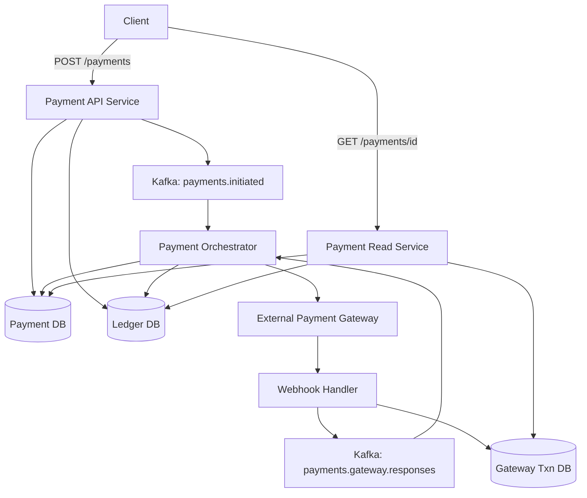

# Payment Service Design (Product-Level, No Wallet)

---

## 1. Problem Statement (Start Here in Interview)

> We need a payment service that can safely determine whether an order 
> is paid or not, under retries, crashes, timeouts, and duplicate external responses.

Key guarantees:

1. No double charge
2. No lost money
3. Idempotent behavior
4. Full auditability

Out of scope:

* bank internals
* PCI vaults
* card/UPI protocols

---

## 2. Core Invariants (Non-Negotiable)

These drive **every design decision**.

### Invariant 1 — Money correctness

> Money can never be created, destroyed, or duplicated.

### Invariant 2 — Idempotency

> The same request processed multiple times must have the same effect.

### Invariant 3 — Durability

> If money moved, it must be recorded permanently.

### Invariant 4 — External systems are unreliable

> External confirmations can be delayed, duplicated, or reordered.

---

## 3. Key Design Principle

> **Balances are never updated directly.
> Money movement is represented as immutable ledger entries.**

---

## 4. High-Level Architecture

We strictly separate:

* **write path** (state mutation)
* **read path** (queries only)



---

## 5. Core Databases and Schemas (Fully Explicit)

### 5.1 Payments Table (Business State)

Represents **intent and lifecycle**, not money.

```text
payments
--------
payment_id        (PK)
order_id
user_id
amount
currency
status            -- CREATED | PROCESSING | SUCCESS | FAILED
idempotency_key   -- unique
created_at
updated_at
```

Rules:

* one payment per order
* idempotency enforced here

---

### 5.2 Accounts Table (Money Holders)

```text
accounts
--------
account_id        (PK)
account_type      -- USER_EXTERNAL | ESCROW | MERCHANT | BANK_CLEARING
user_id           -- nullable (NULL for system accounts)
currency
```

Examples:

* `USER_EXTERNAL` → represents user's card/UPI abstraction
* `ESCROW` → temporary holding
* `MERCHANT` → merchant funds

---

### 5.3 Ledger Entries (Source of Truth)

Append-only. **Never updated or deleted.**

```text
ledger_entries
--------------
ledger_entry_id   (PK)
account_id
user_id           -- nullable
amount            -- negative = debit, positive = credit
currency

reference_type    -- PAYMENT | REFUND
reference_id      -- FK to payments.payment_id or refunds.refund_id

created_at
```

---

### 5.4 Gateway Transactions (Evidence)

Stores **raw external responses**.

```text
gateway_transactions
--------------------
gateway_txn_id    (PK)
payment_id
raw_status        -- SUCCESS | FAILED | PENDING
raw_payload       -- JSON (full gateway response)
received_at
```

---

## 6. Write Path — SUCCESS Flow (Step by Step)

### Scenario

User pays ₹500 for order `ORD123`.

---

### Step 1: Client initiates payment

```
POST /payments
{
  orderId: "ORD123",
  amount: 500,
  idempotencyKey: "pay-ord123"
}
```

---

### Step 2: Payment API validates

Checks:

* order exists
* amount matches
* idempotency key unused

---

### Step 3: Create payment record

```text
payments
--------
payment_id = PAY001
order_id = ORD123
user_id = 42
amount = 500
status = CREATED
```

---

### Step 4: Reserve funds (ledger entries)

```text
ledger_entries
--------------
LE1 | USER_EXTERNAL | user=42 | -500 | PAYMENT | PAY001
LE2 | ESCROW        | NULL    | +500 | PAYMENT | PAY001
```

Meaning:

* user funds locked
* escrow holds uncertainty

---

### Step 5: Move to PROCESSING

```
payments.status = PROCESSING
```

---

### Step 6: Emit Kafka event

```json
{
  "eventType": "PaymentInitiated",
  "paymentId": "PAY001"
}
```

---

### Step 7: Orchestrator calls external system

Outcome is **unknown** (success / failure / timeout).

---

### Step 8: External webhook arrives (SUCCESS)

Webhook handler:

1. validates signature
2. stores raw response
3. emits Kafka event

```text
gateway_transactions
--------------------
GTX1 | PAY001 | SUCCESS | {...}
```

---

### Step 9: Orchestrator finalizes payment

Ledger entries:

```text
LE3 | ESCROW   | NULL | -500 | PAYMENT | PAY001
LE4 | MERCHANT | NULL | +500 | PAYMENT | PAY001
```

---

### Step 10: Mark payment SUCCESS

```
payments.status = SUCCESS
```

---

## 7. Ledger State After SUCCESS

| Account       | Net Amount |
| ------------- | ---------- |
| USER_EXTERNAL | -500       |
| ESCROW        | 0          |
| MERCHANT      | +500       |

Correct and conserved.

---

## 8. Write Path — FAILURE Flow

Same steps until **reservation**.

---

### External webhook indicates FAILURE

---

### Rollback reservation (new ledger entries)

```text
LE3 | ESCROW        | NULL | -500 | PAYMENT | PAY001
LE4 | USER_EXTERNAL | 42   | +500 | PAYMENT | PAY001
```

---

### Mark payment FAILED

```
payments.status = FAILED
```

---

## 9. Ledger State After FAILURE

| Account       | Net Amount |
| ------------- | ---------- |
| USER_EXTERNAL | 0          |
| ESCROW        | 0          |
| MERCHANT      | 0          |

No money lost. Full audit trail preserved.

---

## 10. Read Path (Queries Only)

### Get payment status

```
GET /payments/PAY001
```

Read service:

* reads `payments`
* optionally reads `ledger_entries`
* optionally reads `gateway_transactions`

❌ No writes
❌ No Kafka

---

## 11. Idempotency (Critical)

* enforced via `idempotency_key` on `payments`
* duplicate requests return existing `payment_id`
* no duplicate ledger writes

---

## 12. Why This Design Works Under Failures

| Failure           | Protection               |
| ----------------- | ------------------------ |
| API retry         | idempotency key          |
| Service crash     | ledger durability        |
| Duplicate webhook | orchestrator idempotency |
| Kafka replay      | state checks             |
| Timeout           | async resolution         |

---

## 13. What We Explicitly Did NOT Do

* no balance columns
* no direct money mutation
* no reliance on sync gateway response
* no hidden assumptions

---

## 14. Interview-Ready Summary (Memorize This)

> The payment service models payments as state machines and money movement as 
> immutable ledger entries. Funds are reserved first using escrow, then finalized or 
> rolled back based on asynchronous external confirmation. Idempotency and append-only 
> ledgers guarantee correctness under retries and failures.
> 

---

## 15. One-Line Mental Model

> **Payments change state.
> Ledgers move money.
> Everything else is coordination.**

---

